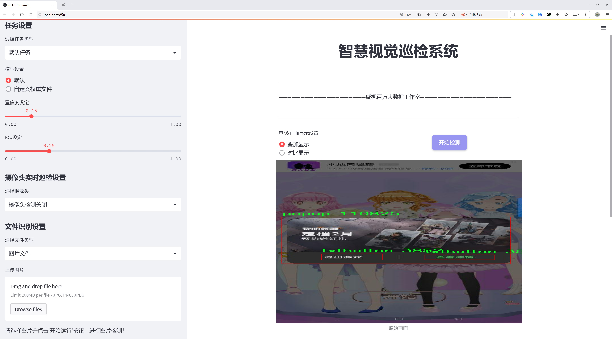
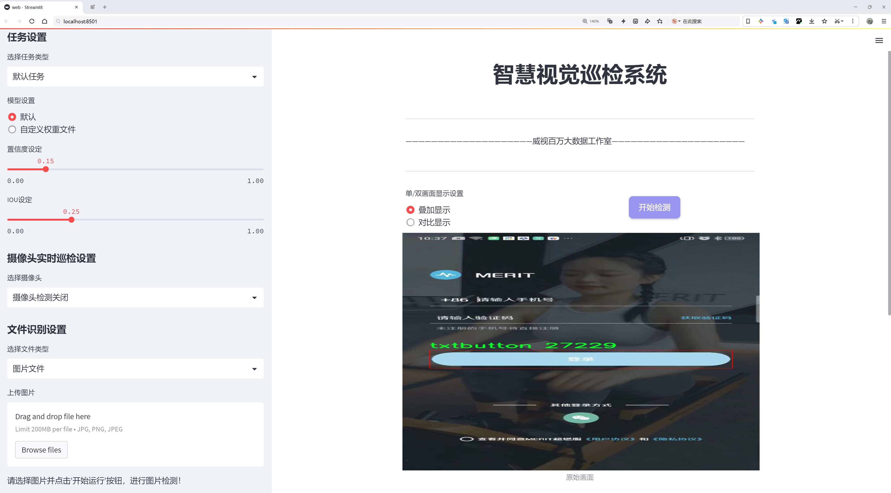
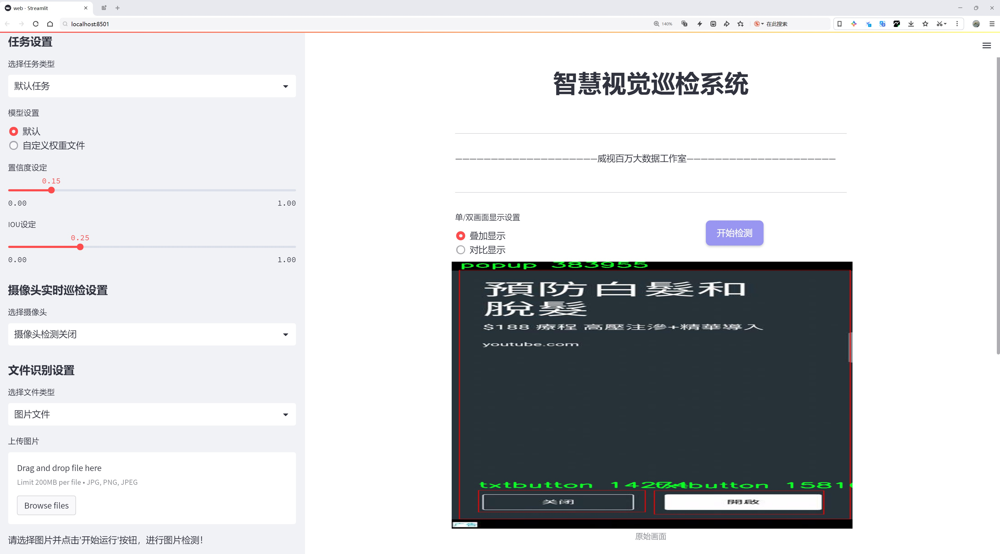
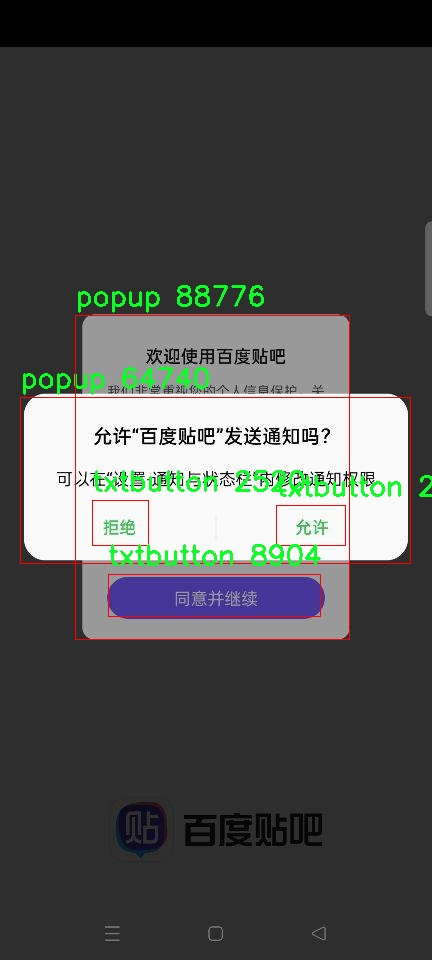
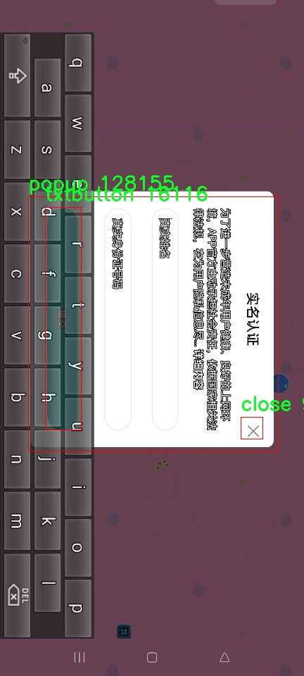
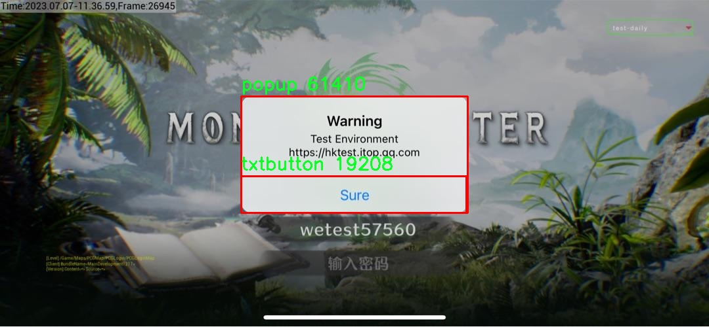
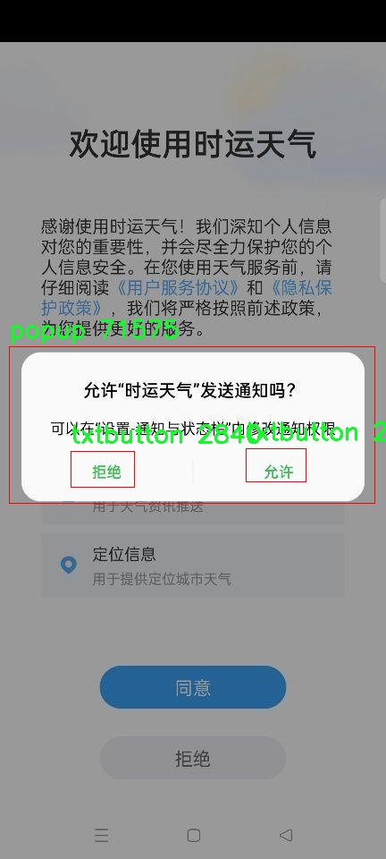

# 对话框按钮检测检测系统源码分享
 # [一条龙教学YOLOV8标注好的数据集一键训练_70+全套改进创新点发刊_Web前端展示]

### 1.研究背景与意义

项目参考[AAAI Association for the Advancement of Artificial Intelligence](https://gitee.com/qunshansj/projects)

项目来源[AACV Association for the Advancement of Computer Vision](https://gitee.com/qunmasj/projects)

研究背景与意义

随着信息技术的迅猛发展，用户界面设计在软件应用中的重要性日益凸显。对话框作为用户与系统交互的重要媒介，其按钮的准确识别与响应直接影响用户体验和操作效率。近年来，深度学习技术的进步为计算机视觉领域带来了革命性的变化，尤其是在物体检测方面，YOLO（You Only Look Once）系列模型凭借其高效性和准确性，成为了众多研究者和开发者的首选工具。YOLOv8作为该系列的最新版本，进一步提升了检测精度和速度，适用于实时应用场景。然而，针对特定应用场景，如对话框按钮的检测，现有的YOLOv8模型仍存在一定的局限性，尤其是在复杂背景和多样化按钮样式下的识别能力。

本研究旨在基于改进的YOLOv8模型，构建一个高效的对话框按钮检测系统。为实现这一目标，我们将利用一个包含8000张图像的数据集，该数据集涵盖了四类按钮：check、close、popup和txtbutton。这些类别的多样性不仅反映了实际应用中的复杂性，也为模型的训练提供了丰富的样本。通过对数据集的深入分析，我们可以识别出不同类别按钮的特征，进而为模型的改进提供理论依据。

在对话框按钮检测中，准确性和实时性是两个关键指标。传统的检测方法往往依赖于手工特征提取，难以适应快速变化的用户界面需求。而基于YOLOv8的深度学习方法，能够通过端到端的训练过程，自动学习特征，从而提高检测的准确性。此外，YOLOv8的高效性使其能够在较低的计算资源下实现实时检测，这对于需要快速响应的用户交互场景尤为重要。

本研究的意义不仅在于技术上的创新，更在于其广泛的应用前景。随着人工智能技术的不断发展，越来越多的应用场景需要智能化的用户界面，尤其是在移动应用、网页设计和智能设备等领域。通过构建一个高效的对话框按钮检测系统，我们可以为这些应用提供更为智能的交互体验，提升用户满意度。同时，该系统的成功实现也为其他领域的物体检测提供了借鉴，推动了计算机视觉技术的进一步发展。

综上所述，基于改进YOLOv8的对话框按钮检测系统的研究，不仅具有重要的理论价值，还有着广泛的实际应用意义。通过对数据集的充分利用和模型的不断优化，我们期望能够在物体检测领域取得突破，为未来的智能交互系统奠定坚实的基础。

### 2.图片演示







##### 注意：由于此博客编辑较早，上面“2.图片演示”和“3.视频演示”展示的系统图片或者视频可能为老版本，新版本在老版本的基础上升级如下：（实际效果以升级的新版本为准）

  （1）适配了YOLOV8的“目标检测”模型和“实例分割”模型，通过加载相应的权重（.pt）文件即可自适应加载模型。

  （2）支持“图片识别”、“视频识别”、“摄像头实时识别”三种识别模式。

  （3）支持“图片识别”、“视频识别”、“摄像头实时识别”三种识别结果保存导出，解决手动导出（容易卡顿出现爆内存）存在的问题，识别完自动保存结果并导出到tempDir中。

  （4）支持Web前端系统中的标题、背景图等自定义修改，后面提供修改教程。

  另外本项目提供训练的数据集和训练教程,暂不提供权重文件（best.pt）,需要您按照教程进行训练后实现图片演示和Web前端界面演示的效果。

### 3.视频演示

[3.1 视频演示](https://www.bilibili.com/video/BV1oPtLeYEWA/)

### 4.数据集信息展示

##### 4.1 本项目数据集详细数据（类别数＆类别名）

nc: 3
names: ['close', 'popup', 'txtbutton']


##### 4.2 本项目数据集信息介绍

数据集信息展示

在本研究中，我们使用了名为“ICON Detection”的数据集，以改进YOLOv8模型在对话框按钮检测系统中的性能。该数据集专注于识别用户界面中的三种主要按钮类型，分别是“close”（关闭按钮）、“popup”（弹出按钮）和“txtbutton”（文本按钮）。通过对这些类别的深入分析和训练，我们旨在提升模型在实际应用场景中的准确性和鲁棒性。

“ICON Detection”数据集的构建经过精心设计，确保了其在多样性和代表性方面的优势。每个类别的样本均经过严格筛选，涵盖了不同风格、颜色和形状的按钮，反映了现代用户界面的多样性。这种多样性不仅增强了模型的泛化能力，还为其在各种应用场景中的适应性提供了保障。尤其是在用户界面设计日益丰富的今天，能够准确识别不同类型的按钮，对于提升用户体验和交互效率至关重要。

在数据集的标注过程中，我们采用了高标准的标注策略，确保每个按钮的边界框都准确无误。通过使用专业的标注工具，标注人员对每个图像中的按钮进行了精确的框选，并为其分配了相应的类别标签。这一过程不仅提高了数据集的质量，也为后续的模型训练奠定了坚实的基础。高质量的标注数据是深度学习模型成功的关键因素之一，尤其是在目标检测任务中，准确的边界框和类别标签能够显著提升模型的学习效果。

为了进一步增强数据集的实用性，我们还进行了数据增强处理，包括旋转、缩放、裁剪和颜色变换等。这些技术不仅增加了数据集的样本数量，还提高了模型对不同场景和条件的适应能力。例如，通过对按钮图像进行随机旋转和缩放，模型能够学习到在不同角度和大小下的按钮特征，从而提升其在实际应用中的表现。

在训练过程中，我们将“ICON Detection”数据集与YOLOv8模型相结合，利用其先进的特征提取和目标检测能力，进行多轮次的训练和验证。通过不断调整模型参数和优化算法，我们期望实现更高的检测精度和更快的推理速度。尤其是在对话框按钮的实时检测中，快速响应和高准确率是提升用户体验的关键。

综上所述，“ICON Detection”数据集为我们改进YOLOv8的对话框按钮检测系统提供了丰富的训练素材和坚实的基础。通过对数据集的深入分析和合理利用，我们相信能够在用户界面交互领域取得显著的进展，为未来的研究和应用提供有力支持。随着技术的不断发展，我们期待“ICON Detection”数据集能够在更多相关研究中发挥重要作用，推动对话框按钮检测技术的进一步发展。










### 5.全套项目环境部署视频教程（零基础手把手教学）

[5.1 环境部署教程链接（零基础手把手教学）](https://www.ixigua.com/7404473917358506534?logTag=c807d0cbc21c0ef59de5)


[5.2 安装Python虚拟环境创建和依赖库安装视频教程链接（零基础手把手教学）](https://www.ixigua.com/7404474678003106304?logTag=1f1041108cd1f708b01a)

### 6.手把手YOLOV8训练视频教程（零基础小白有手就能学会）

[6.1 手把手YOLOV8训练视频教程（零基础小白有手就能学会）](https://www.ixigua.com/7404477157818401292?logTag=d31a2dfd1983c9668658)

### 7.70+种全套YOLOV8创新点代码加载调参视频教程（一键加载写好的改进模型的配置文件）

[7.1 70+种全套YOLOV8创新点代码加载调参视频教程（一键加载写好的改进模型的配置文件）](https://www.ixigua.com/7404478314661806627?logTag=29066f8288e3f4eea3a4)

### 8.70+种全套YOLOV8创新点原理讲解（非科班也可以轻松写刊发刊，V10版本正在科研待更新）

由于篇幅限制，每个创新点的具体原理讲解就不一一展开，具体见下列网址中的创新点对应子项目的技术原理博客网址【Blog】：


[8.1 70+种全套YOLOV8创新点原理讲解链接](https://gitee.com/qunmasj/good)

### 9.系统功能展示（检测对象为举例，实际内容以本项目数据集为准）

图9.1.系统支持检测结果表格显示

  图9.2.系统支持置信度和IOU阈值手动调节

  图9.3.系统支持自定义加载权重文件best.pt(需要你通过步骤5中训练获得)

  图9.4.系统支持摄像头实时识别

  图9.5.系统支持图片识别

  图9.6.系统支持视频识别

  图9.7.系统支持识别结果文件自动保存

  图9.8.系统支持Excel导出检测结果数据


### 10.原始YOLOV8算法原理

原始YOLOv8算法原理

YOLOv8算法是由Ultralytics公司于2023年发布的目标检测算法，标志着YOLO系列的又一次重要进化。作为YOLO系列的最新成员，YOLOv8在设计上延续了前几代算法的核心思想，同时在多个方面进行了显著的改进与优化，尤其是在模型结构、特征提取、损失函数以及数据处理等方面，展现出更高的效率和准确性。

首先，YOLOv8在数据预处理方面依然采用了YOLOv5的策略，但在具体的增强手段上进行了扩展。算法引入了马赛克增强、混合增强、空间扰动和颜色扰动等多种数据增强技术，这些技术不仅丰富了训练数据的多样性，还有效提升了模型的鲁棒性。通过这些预处理手段，YOLOv8能够更好地适应不同场景下的目标检测任务，从而提升了模型的泛化能力。

在骨干网络结构上，YOLOv8延续了YOLOv5的设计思路，但对其进行了优化。YOLOv5的主干网络通过逐层降采样特征图并使用C3模块来强化特征提取，而YOLOv8则将C3模块替换为C2f模块。C2f模块的引入使得网络在特征提取时能够形成更多的分支，从而在梯度回传过程中丰富了信息流。这种设计不仅提升了特征提取的效率，还在一定程度上减轻了模型的计算负担。

YOLOv8在特征融合方面采用了FPN-PAN结构，继续利用特征金字塔的思想来实现多尺度信息的融合。FPN（Feature Pyramid Network）和PAN（Path Aggregation Network）的结合使得YOLOv8能够在不同尺度的特征图之间进行有效的信息传递和融合，从而提高了模型对小目标的检测能力。尽管FPN-PAN结构与YOLOv5基本一致，但C3模块的替换使得YOLOv8在特征融合的灵活性和效率上有了进一步的提升。

在检测头的设计上，YOLOv8采用了解耦头结构，这一结构的引入是YOLO系列的一次重要创新。与之前的耦合结构不同，解耦头将分类和定位任务分开处理，分别通过两条并行的分支进行特征提取。这种设计不仅提升了模型的检测精度，还降低了任务之间的干扰，使得YOLOv8在复杂场景下的表现更加出色。

YOLOv8在标签分配策略上也进行了重要的改进。不同于YOLOv5依赖于数据集的自动聚类候选框，YOLOv8采用了动态标签分配策略TOOD（Target-Oriented Object Detection）。这一策略通过直接使用目标边界框和目标分数来进行正负样本的匹配，从而避免了候选框与真实物体尺寸不匹配的问题。YOLOv8的损失函数设计也体现了这一创新，分类损失采用了变焦损失（Varifocal Loss），而回归损失则结合了CIoU Loss和DFL Loss。这种损失函数的设计使得模型在训练过程中能够更加关注高质量的正样本，从而提升了整体的检测性能。

在YOLOv8的整体设计中，跨级结构（CSP）依然被保留，并在此基础上进行了优化。通过将C3模块替换为C2f模块，YOLOv8不仅减轻了模型的复杂度，还提升了特征提取的灵活性。此外，YOLOv8还保留了空间金字塔池化（SPPF）模块，这一模块的引入进一步提高了模型的计算速度，使得YOLOv8在实时目标检测任务中表现得更加出色。

总的来说，YOLOv8算法通过一系列的结构优化和创新，提升了目标检测的效率和准确性。其在数据预处理、骨干网络、特征融合、检测头设计以及标签分配策略等方面的改进，使得YOLOv8在各种复杂场景下都能展现出卓越的性能。作为YOLO系列的最新成员，YOLOv8不仅延续了前几代算法的优良传统，还在此基础上进行了深度的创新，为目标检测领域的发展提供了新的思路和方向。通过对YOLOv8的深入研究与应用，研究者们可以在目标检测的各个领域中实现更高效、更准确的检测效果，为实际应用提供更为强大的技术支持。


### 11.项目核心源码讲解（再也不用担心看不懂代码逻辑）

#### 11.1 code\ultralytics\solutions\__init__.py

由于您提供的代码片段非常有限，仅包含了一行注释，无法进行逐文件分析或提取核心部分。不过，我可以为您解释这行代码的含义，并提供一些与Ultralytics YOLO相关的背景信息。

```python
# Ultralytics YOLO 🚀, AGPL-3.0 license
```

### 代码分析

1. **Ultralytics YOLO**: 
   - 这是一个流行的目标检测模型，YOLO（You Only Look Once）是其核心算法。Ultralytics是一个团队或组织，专注于开发和维护YOLO模型的实现。

2. **🚀**: 
   - 这个表情符号通常用来表示快速或高效，暗示Ultralytics YOLO在性能上有很好的表现。

3. **AGPL-3.0 license**: 
   - 这是一个开源许可证，称为“GNU Affero General Public License v3.0”。它允许用户自由使用、修改和分发软件，但要求任何基于该软件的修改或衍生作品也必须在相同许可证下发布。这意味着如果您使用了Ultralytics YOLO并进行了修改，您需要将您的修改也开源。

### 总结

虽然提供的代码片段非常简单，但它标识了一个开源项目的基本信息，包括项目名称、许可证类型和对项目性能的暗示。如果您有更具体的代码或文件需要分析，请提供更多内容，我将乐意帮助您进行详细分析和注释。

这个文件是Ultralytics YOLO项目的一部分，文件名为`__init__.py`，它通常用于标识一个Python包。根据文件中的注释，这个项目与YOLO（You Only Look Once）目标检测算法相关，并且遵循AGPL-3.0许可证。

在Python中，`__init__.py`文件的存在使得Python解释器将包含该文件的目录视为一个包，从而可以导入该目录下的模块和子模块。虽然这个文件的代码非常简单，仅包含一行注释，但它的存在对于包的结构和模块的导入是至关重要的。

注释中提到的“Ultralytics YOLO”表示这个项目是由Ultralytics团队开发的YOLO目标检测实现，YOLO是一种实时目标检测系统，广泛应用于计算机视觉领域。AGPL-3.0许可证则意味着该项目是开源的，用户可以自由使用、修改和分发代码，但在分发修改后的版本时需要遵循相同的许可证条款。

总的来说，这个`__init__.py`文件虽然内容简单，但它在项目的结构和模块管理中起到了重要的作用，同时也表明了该项目的开源性质和相关的法律条款。

#### 11.2 code\ultralytics\data\base.py

以下是经过简化和注释的核心代码部分：

```python
import glob
import os
from pathlib import Path
import cv2
import numpy as np
from torch.utils.data import Dataset

class BaseDataset(Dataset):
    """
    基础数据集类，用于加载和处理图像数据。

    参数:
        img_path (str): 图像文件夹的路径。
        imgsz (int, optional): 图像大小，默认为640。
        augment (bool, optional): 是否应用数据增强，默认为True。
        classes (list): 包含的类别列表，默认为None。
    """

    def __init__(self, img_path, imgsz=640, augment=True, classes=None):
        """初始化BaseDataset，设置配置和选项。"""
        super().__init__()
        self.img_path = img_path  # 图像路径
        self.imgsz = imgsz  # 图像大小
        self.augment = augment  # 是否进行数据增强
        self.im_files = self.get_img_files(self.img_path)  # 获取图像文件列表
        self.labels = self.get_labels()  # 获取标签
        self.update_labels(include_class=classes)  # 更新标签以仅包含指定类别
        self.ni = len(self.labels)  # 数据集中图像的数量

    def get_img_files(self, img_path):
        """读取图像文件。"""
        f = []  # 存储图像文件路径
        # 遍历给定路径
        for p in img_path if isinstance(img_path, list) else [img_path]:
            p = Path(p)  # 处理路径
            if p.is_dir():  # 如果是目录
                f += glob.glob(str(p / "**" / "*.*"), recursive=True)  # 获取所有图像文件
            elif p.is_file():  # 如果是文件
                with open(p) as t:
                    t = t.read().strip().splitlines()  # 读取文件内容
                    parent = str(p.parent) + os.sep
                    f += [x.replace("./", parent) if x.startswith("./") else x for x in t]  # 替换路径
            else:
                raise FileNotFoundError(f"{p} 不存在")
        # 过滤出有效的图像文件
        im_files = sorted(x for x in f if x.split(".")[-1].lower() in IMG_FORMATS)
        assert im_files, f"在 {img_path} 中未找到图像"
        return im_files

    def update_labels(self, include_class):
        """更新标签以仅包含指定类别（可选）。"""
        for i in range(len(self.labels)):
            if include_class is not None:
                cls = self.labels[i]["cls"]
                # 仅保留指定类别的标签
                j = np.isin(cls, include_class)
                self.labels[i]["cls"] = cls[j]

    def load_image(self, i):
        """加载数据集中索引为 'i' 的图像，返回图像及其原始和调整后的尺寸。"""
        im = cv2.imread(self.im_files[i])  # 读取图像
        if im is None:
            raise FileNotFoundError(f"未找到图像 {self.im_files[i]}")
        # 调整图像大小
        im = cv2.resize(im, (self.imgsz, self.imgsz), interpolation=cv2.INTER_LINEAR)
        return im, im.shape[:2]  # 返回图像和尺寸

    def __getitem__(self, index):
        """返回给定索引的图像和标签信息。"""
        label = self.labels[index]  # 获取标签
        label["img"], label["ori_shape"] = self.load_image(index)  # 加载图像
        return label  # 返回标签信息

    def __len__(self):
        """返回数据集的长度。"""
        return len(self.labels)

    def get_labels(self):
        """用户可以自定义标签格式，这里需要返回标签的字典。"""
        raise NotImplementedError
```

### 代码注释说明：

1. **BaseDataset 类**：这是一个继承自 `Dataset` 的基础类，用于处理图像数据集的加载和预处理。

2. **__init__ 方法**：初始化数据集，设置图像路径、图像大小、是否进行数据增强等参数，并调用相关方法获取图像文件和标签。

3. **get_img_files 方法**：读取指定路径下的图像文件，支持目录和文件列表，返回有效的图像文件路径。

4. **update_labels 方法**：根据指定的类别更新标签，只保留包含这些类别的标签。

5. **load_image 方法**：加载指定索引的图像，并调整其大小，返回图像及其原始尺寸。

6. **__getitem__ 方法**：根据索引返回图像和对应的标签信息。

7. **__len__ 方法**：返回数据集中标签的数量。

8. **get_labels 方法**：此方法需由用户实现，用于自定义标签格式。

这个程序文件定义了一个名为 `BaseDataset` 的类，主要用于加载和处理图像数据，特别是在计算机视觉任务中常用的YOLO（You Only Look Once）模型的训练。类的构造函数接收多个参数，以便灵活配置数据集的加载和处理方式。

在初始化过程中，首先调用父类的构造函数，然后根据提供的图像路径读取图像文件。通过 `get_img_files` 方法，程序会遍历指定路径，支持读取文件夹中的所有图像文件或从文本文件中加载图像路径。加载的图像路径会根据预定义的图像格式进行过滤，并且可以根据 `fraction` 参数选择使用数据集的一部分。

接下来，程序会调用 `get_labels` 方法来获取图像的标签信息。标签信息是一个字典，包含了图像的类别、边界框、分割信息等。然后，程序会根据需要更新标签信息，以确保只包含指定的类别（如果有提供的话），并处理单类训练的情况。

在图像加载方面，`load_image` 方法负责从数据集中加载单张图像，并根据指定的模式（长边缩放或拉伸到正方形）调整图像大小。如果图像已经被缓存到内存中，则直接返回缓存的图像；否则，程序会尝试从磁盘加载图像，并在加载失败时抛出异常。

为了提高训练效率，程序还实现了图像缓存机制。`cache_images` 方法可以将图像缓存到内存或磁盘中，具体取决于传入的参数。程序会根据可用内存检查是否可以将图像缓存到RAM中，避免内存不足的问题。

此外，`set_rectangle` 方法用于设置YOLO检测的边界框形状为矩形，以便在训练过程中能够更好地处理不同长宽比的图像。`__getitem__` 方法则返回指定索引的图像及其标签信息，并应用数据增强变换。

最后，`build_transforms` 和 `get_labels` 方法是留给用户自定义的部分，用户可以根据自己的需求实现数据增强和标签格式的自定义处理。

总体来说，这个 `BaseDataset` 类为YOLO模型的训练提供了一个灵活且高效的数据加载和处理框架，支持多种配置选项以适应不同的训练需求。

#### 11.3 ui.py

```python
import sys
import subprocess

def run_script(script_path):
    """
    使用当前 Python 环境运行指定的脚本。

    Args:
        script_path (str): 要运行的脚本路径

    Returns:
        None
    """
    # 获取当前 Python 解释器的路径
    python_path = sys.executable

    # 构建运行命令
    command = f'"{python_path}" -m streamlit run "{script_path}"'

    # 执行命令
    result = subprocess.run(command, shell=True)
    if result.returncode != 0:
        print("脚本运行出错。")


# 实例化并运行应用
if __name__ == "__main__":
    # 指定您的脚本路径
    script_path = "web.py"  # 这里直接指定脚本路径

    # 运行脚本
    run_script(script_path)
```

### 代码注释说明：

1. **导入模块**：
   - `import sys`：导入 `sys` 模块以获取 Python 解释器的路径。
   - `import subprocess`：导入 `subprocess` 模块以便能够在 Python 中执行外部命令。

2. **定义 `run_script` 函数**：
   - 该函数接受一个参数 `script_path`，表示要运行的 Python 脚本的路径。
   - 函数内部首先获取当前 Python 解释器的路径，存储在 `python_path` 变量中。
   - 然后构建一个命令字符串 `command`，该命令使用 `streamlit` 模块运行指定的脚本。
   - 使用 `subprocess.run` 方法执行构建的命令。如果命令执行返回的状态码不为 0，表示脚本运行出错，打印错误信息。

3. **主程序入口**：
   - 使用 `if __name__ == "__main__":` 确保只有在直接运行该脚本时才会执行以下代码。
   - 指定要运行的脚本路径为 `web.py`。
   - 调用 `run_script` 函数来执行指定的脚本。

这个程序文件名为 `ui.py`，其主要功能是使用当前的 Python 环境来运行一个指定的脚本。代码中首先导入了必要的模块，包括 `sys`、`os` 和 `subprocess`，以及一个自定义的路径处理模块 `abs_path`。

在 `run_script` 函数中，程序接受一个参数 `script_path`，这个参数是要运行的脚本的路径。函数首先获取当前 Python 解释器的路径，这样可以确保使用正确的 Python 环境来执行脚本。接着，程序构建了一个命令字符串，该命令使用 `streamlit` 来运行指定的脚本。这里使用了 `subprocess.run` 方法来执行这个命令，并且通过 `shell=True` 选项允许在 shell 中执行命令。

在执行命令后，程序检查返回的结果。如果返回码不为 0，表示脚本运行过程中出现了错误，程序会打印出相应的错误信息。

在文件的最后部分，程序通过 `if __name__ == "__main__":` 来判断是否直接运行该脚本。如果是，程序会指定一个脚本路径，这里是通过 `abs_path` 函数获取的 `web.py` 的绝对路径。然后，调用 `run_script` 函数来运行这个脚本。

总体来说，这个程序的主要作用是提供一个简单的接口，以便在当前 Python 环境中运行一个指定的 Streamlit 脚本，并处理可能出现的错误。

#### 11.4 train.py

以下是经过简化和注释的核心代码部分：

```python
import random
import numpy as np
import torch.nn as nn
from ultralytics.data import build_dataloader, build_yolo_dataset
from ultralytics.engine.trainer import BaseTrainer
from ultralytics.models import yolo
from ultralytics.nn.tasks import DetectionModel
from ultralytics.utils import LOGGER, RANK
from ultralytics.utils.torch_utils import de_parallel, torch_distributed_zero_first

class DetectionTrainer(BaseTrainer):
    """
    基于检测模型的训练类，继承自BaseTrainer类。
    """

    def build_dataset(self, img_path, mode="train", batch=None):
        """
        构建YOLO数据集。

        参数:
            img_path (str): 图像文件夹的路径。
            mode (str): 模式，可以是'train'或'val'，用户可以为每种模式自定义不同的增强。
            batch (int, optional): 批次大小，仅用于'rect'模式。默认为None。
        """
        gs = max(int(de_parallel(self.model).stride.max() if self.model else 0), 32)  # 获取模型的最大步幅
        return build_yolo_dataset(self.args, img_path, batch, self.data, mode=mode, rect=mode == "val", stride=gs)

    def get_dataloader(self, dataset_path, batch_size=16, rank=0, mode="train"):
        """构建并返回数据加载器。"""
        assert mode in ["train", "val"]  # 确保模式有效
        with torch_distributed_zero_first(rank):  # 仅在DDP情况下初始化数据集*.cache一次
            dataset = self.build_dataset(dataset_path, mode, batch_size)  # 构建数据集
        shuffle = mode == "train"  # 训练模式下打乱数据
        workers = self.args.workers if mode == "train" else self.args.workers * 2  # 根据模式设置工作线程数
        return build_dataloader(dataset, batch_size, workers, shuffle, rank)  # 返回数据加载器

    def preprocess_batch(self, batch):
        """对图像批次进行预处理，包括缩放和转换为浮点数。"""
        batch["img"] = batch["img"].to(self.device, non_blocking=True).float() / 255  # 将图像转换为浮点数并归一化
        if self.args.multi_scale:  # 如果启用多尺度
            imgs = batch["img"]
            sz = (
                random.randrange(self.args.imgsz * 0.5, self.args.imgsz * 1.5 + self.stride)
                // self.stride
                * self.stride
            )  # 随机选择新的图像大小
            sf = sz / max(imgs.shape[2:])  # 计算缩放因子
            if sf != 1:  # 如果缩放因子不为1
                ns = [
                    math.ceil(x * sf / self.stride) * self.stride for x in imgs.shape[2:]
                ]  # 计算新的形状
                imgs = nn.functional.interpolate(imgs, size=ns, mode="bilinear", align_corners=False)  # 进行插值缩放
            batch["img"] = imgs  # 更新批次图像
        return batch

    def get_model(self, cfg=None, weights=None, verbose=True):
        """返回YOLO检测模型。"""
        model = DetectionModel(cfg, nc=self.data["nc"], verbose=verbose and RANK == -1)  # 创建检测模型
        if weights:
            model.load(weights)  # 加载权重
        return model

    def plot_training_samples(self, batch, ni):
        """绘制带有注释的训练样本。"""
        plot_images(
            images=batch["img"],
            batch_idx=batch["batch_idx"],
            cls=batch["cls"].squeeze(-1),
            bboxes=batch["bboxes"],
            paths=batch["im_file"],
            fname=self.save_dir / f"train_batch{ni}.jpg",
            on_plot=self.on_plot,
        )

    def plot_metrics(self):
        """从CSV文件中绘制指标。"""
        plot_results(file=self.csv, on_plot=self.on_plot)  # 保存结果图
```

### 代码说明：
1. **DetectionTrainer类**：这是一个用于训练YOLO检测模型的类，继承自`BaseTrainer`。
2. **build_dataset方法**：构建YOLO数据集，接受图像路径、模式和批次大小作为参数。
3. **get_dataloader方法**：构建并返回数据加载器，支持训练和验证模式。
4. **preprocess_batch方法**：对输入的图像批次进行预处理，包括归一化和多尺度调整。
5. **get_model方法**：创建并返回YOLO检测模型，可以选择加载预训练权重。
6. **plot_training_samples方法**：绘制训练样本及其注释，便于可视化训练过程。
7. **plot_metrics方法**：从CSV文件中绘制训练指标，便于分析模型性能。

这个程序文件 `train.py` 是一个用于训练目标检测模型的代码，主要基于 YOLO（You Only Look Once）框架。代码首先导入了一些必要的库和模块，包括数学运算、随机数生成、深度学习相关的库（如 PyTorch），以及 Ultralytics 提供的工具和模型。

在代码中，定义了一个名为 `DetectionTrainer` 的类，该类继承自 `BaseTrainer`，专门用于基于检测模型的训练。类的文档字符串中给出了一个简单的使用示例，展示了如何创建一个 `DetectionTrainer` 实例并调用其 `train` 方法进行训练。

`DetectionTrainer` 类包含多个方法，主要功能如下：

- `build_dataset` 方法用于构建 YOLO 数据集。它接收图像路径、模式（训练或验证）和批量大小作为参数，并根据这些参数构建数据集。该方法还会根据模型的步幅（stride）确定数据集的处理方式。

- `get_dataloader` 方法用于构建并返回数据加载器。它会根据模式（训练或验证）选择合适的参数，并在分布式训练时确保数据集只初始化一次。

- `preprocess_batch` 方法对一批图像进行预处理，包括缩放和转换为浮点数格式。它还支持多尺度训练，通过随机选择图像大小来增强模型的鲁棒性。

- `set_model_attributes` 方法用于设置模型的属性，包括类别数量和类别名称。这些属性是根据数据集的标签信息进行设置的。

- `get_model` 方法返回一个 YOLO 检测模型的实例，并可以加载预训练权重。

- `get_validator` 方法返回一个用于验证 YOLO 模型的验证器实例，主要用于评估模型的性能。

- `label_loss_items` 方法返回一个包含训练损失项的字典，便于后续的损失监控和分析。

- `progress_string` 方法返回一个格式化的字符串，显示训练进度，包括当前的 epoch、GPU 内存使用情况、损失值、实例数量和图像大小等信息。

- `plot_training_samples` 方法用于绘制训练样本及其标注，帮助可视化训练过程中的数据。

- `plot_metrics` 方法用于从 CSV 文件中绘制训练过程中的指标，并保存结果图像。

- `plot_training_labels` 方法用于创建一个带标签的训练图，展示数据集中所有标注的边界框和类别信息。

总体而言，这个文件实现了 YOLO 模型的训练过程，包括数据集的构建、数据加载、模型的设置与训练、损失监控以及结果的可视化等功能。通过这些功能，用户可以方便地进行目标检测模型的训练和评估。

#### 11.5 code\ultralytics\solutions\speed_estimation.py

以下是经过简化并添加详细中文注释的核心代码部分：

```python
import cv2
import numpy as np
from collections import defaultdict
from time import time

class SpeedEstimator:
    """用于实时视频流中对象速度估计的类。"""

    def __init__(self):
        """初始化速度估计器类，设置默认值。"""
        self.im0 = None  # 当前帧图像
        self.annotator = None  # 注释器，用于绘制
        self.reg_pts = [(20, 400), (1260, 400)]  # 速度计算区域的两个点
        self.trk_history = defaultdict(list)  # 存储每个跟踪对象的历史轨迹
        self.dist_data = {}  # 存储每个跟踪对象的速度数据
        self.trk_previous_times = {}  # 存储每个跟踪对象的上次时间
        self.trk_previous_points = {}  # 存储每个跟踪对象的上次位置

    def extract_tracks(self, tracks):
        """从跟踪数据中提取边界框和类别信息。"""
        self.boxes = tracks[0].boxes.xyxy.cpu()  # 获取边界框坐标
        self.clss = tracks[0].boxes.cls.cpu().tolist()  # 获取类别
        self.trk_ids = tracks[0].boxes.id.int().cpu().tolist()  # 获取跟踪ID

    def store_track_info(self, track_id, box):
        """存储跟踪对象的位置信息。"""
        track = self.trk_history[track_id]  # 获取当前跟踪ID的历史轨迹
        bbox_center = (float((box[0] + box[2]) / 2), float((box[1] + box[3]) / 2))  # 计算边界框中心
        track.append(bbox_center)  # 将中心点添加到历史轨迹中

        if len(track) > 30:  # 限制历史轨迹长度
            track.pop(0)

        self.trk_pts = np.hstack(track).astype(np.int32).reshape((-1, 1, 2))  # 转换为适合绘制的格式
        return track

    def calculate_speed(self, trk_id, track):
        """计算对象的速度。"""
        # 检查对象是否在速度计算区域内
        if not self.reg_pts[0][0] < track[-1][0] < self.reg_pts[1][0]:
            return
        
        # 确定对象的运动方向
        direction = "unknown"
        if self.reg_pts[1][1] - 10 < track[-1][1] < self.reg_pts[1][1] + 10:
            direction = "known"
        elif self.reg_pts[0][1] - 10 < track[-1][1] < self.reg_pts[0][1] + 10:
            direction = "known"

        # 计算速度
        if self.trk_previous_times[trk_id] != 0 and direction != "unknown":
            time_difference = time() - self.trk_previous_times[trk_id]  # 计算时间差
            if time_difference > 0:
                dist_difference = np.abs(track[-1][1] - self.trk_previous_points[trk_id][1])  # 计算位置差
                speed = dist_difference / time_difference  # 计算速度
                self.dist_data[trk_id] = speed  # 存储速度数据

        # 更新跟踪对象的上次时间和位置
        self.trk_previous_times[trk_id] = time()
        self.trk_previous_points[trk_id] = track[-1]

    def estimate_speed(self, im0, tracks):
        """根据跟踪数据计算对象速度。"""
        self.im0 = im0  # 保存当前帧图像
        if tracks[0].boxes.id is None:  # 如果没有检测到对象
            return
        
        self.extract_tracks(tracks)  # 提取跟踪数据
        for box, trk_id, cls in zip(self.boxes, self.trk_ids, self.clss):
            track = self.store_track_info(trk_id, box)  # 存储跟踪信息
            self.calculate_speed(trk_id, track)  # 计算速度

        return im0  # 返回处理后的图像

if __name__ == "__main__":
    SpeedEstimator()  # 创建速度估计器实例
```

### 代码核心部分说明：
1. **类的初始化**：`__init__` 方法设置了必要的属性，包括图像、注释器、速度计算区域、跟踪历史等。
2. **提取跟踪数据**：`extract_tracks` 方法从输入的跟踪数据中提取边界框、类别和跟踪ID。
3. **存储跟踪信息**：`store_track_info` 方法计算并存储每个对象的中心点，并限制历史轨迹的长度。
4. **速度计算**：`calculate_speed` 方法根据对象的运动情况计算速度，并更新相关信息。
5. **速度估计**：`estimate_speed` 方法是主要的处理函数，提取跟踪数据并计算速度，最终返回处理后的图像。

这个程序文件是一个用于实时视频流中物体速度估计的类，名为 `SpeedEstimator`。它的主要功能是通过跟踪物体在视频中的运动轨迹，计算并显示物体的速度。

在初始化方法 `__init__` 中，类的属性被设置为默认值，包括图像信息、区域信息、预测和跟踪信息、速度估计信息等。`reg_pts` 属性定义了速度计算的区域，`trk_history` 用于存储每个物体的轨迹，`dist_data` 用于存储每个物体的速度数据。

`set_args` 方法允许用户配置速度估计和显示参数，包括区域点、物体类别名称、是否显示图像、线条厚度等。`extract_tracks` 方法从跟踪数据中提取出物体的边界框、类别和跟踪ID。

`store_track_info` 方法用于存储物体的跟踪数据，计算边界框中心并将其添加到跟踪历史中。`plot_box_and_track` 方法则负责在图像上绘制物体的边界框和轨迹，同时显示速度标签。

`calculate_speed` 方法计算物体的速度。它首先检查物体是否在定义的区域内，然后根据物体的运动方向和时间差计算速度，并将结果存储在 `dist_data` 中。`estimate_speed` 方法是主要的速度估计函数，它处理输入图像和跟踪数据，提取跟踪信息并绘制图像。

最后，`display_frames` 方法用于显示处理后的图像，允许用户查看实时速度估计的结果。整个类的设计使得速度估计过程能够在视频流中实时进行，并通过可视化的方式展示出来。

#### 11.6 70+种YOLOv8算法改进源码大全和调试加载训练教程（非必要）\ultralytics\utils\autobatch.py

以下是代码中最核心的部分，并附上详细的中文注释：

```python
import numpy as np
import torch
from ultralytics.utils import LOGGER, colorstr
from ultralytics.utils.torch_utils import profile

def check_train_batch_size(model, imgsz=640, amp=True):
    """
    检查YOLO训练的最佳批量大小。

    参数:
        model (torch.nn.Module): 要检查批量大小的YOLO模型。
        imgsz (int): 用于训练的图像大小。
        amp (bool): 如果为True，则在训练中使用自动混合精度（AMP）。

    返回:
        (int): 使用autobatch()函数计算的最佳批量大小。
    """
    with torch.cuda.amp.autocast(amp):
        return autobatch(deepcopy(model).train(), imgsz)  # 计算最佳批量大小

def autobatch(model, imgsz=640, fraction=0.60, batch_size=16):
    """
    自动估计最佳YOLO批量大小，以使用可用CUDA内存的一部分。

    参数:
        model (torch.nn.Module): 要计算批量大小的YOLO模型。
        imgsz (int, optional): 用作YOLO模型输入的图像大小。默认为640。
        fraction (float, optional): 要使用的可用CUDA内存的比例。默认为0.60。
        batch_size (int, optional): 如果检测到错误时使用的默认批量大小。默认为16。

    返回:
        (int): 最佳批量大小。
    """
    
    # 检查设备
    prefix = colorstr('AutoBatch: ')
    LOGGER.info(f'{prefix}计算图像大小为{imgsz}的最佳批量大小')
    device = next(model.parameters()).device  # 获取模型所在设备
    if device.type == 'cpu':
        LOGGER.info(f'{prefix}未检测到CUDA，使用默认CPU批量大小 {batch_size}')
        return batch_size
    if torch.backends.cudnn.benchmark:
        LOGGER.info(f'{prefix} ⚠️ 需要torch.backends.cudnn.benchmark=False，使用默认批量大小 {batch_size}')
        return batch_size

    # 检查CUDA内存
    gb = 1 << 30  # 字节转GiB (1024 ** 3)
    properties = torch.cuda.get_device_properties(device)  # 获取设备属性
    t = properties.total_memory / gb  # 总内存（GiB）
    r = torch.cuda.memory_reserved(device) / gb  # 已保留内存（GiB）
    a = torch.cuda.memory_allocated(device) / gb  # 已分配内存（GiB）
    f = t - (r + a)  # 可用内存（GiB）
    LOGGER.info(f'{prefix}{device} ({properties.name}) {t:.2f}G 总, {r:.2f}G 保留, {a:.2f}G 分配, {f:.2f}G 可用')

    # 评估批量大小
    batch_sizes = [1, 2, 4, 8, 16]  # 测试的批量大小
    try:
        img = [torch.empty(b, 3, imgsz, imgsz) for b in batch_sizes]  # 创建空图像张量
        results = profile(img, model, n=3, device=device)  # 评估每个批量大小的性能

        # 拟合解决方案
        y = [x[2] for x in results if x]  # 提取内存使用情况
        p = np.polyfit(batch_sizes[:len(y)], y, deg=1)  # 一次多项式拟合
        b = int((f * fraction - p[1]) / p[0])  # 计算最佳批量大小
        if None in results:  # 如果某些大小失败
            i = results.index(None)  # 找到第一个失败的索引
            if b >= batch_sizes[i]:  # 如果最佳批量大小在失败点之上
                b = batch_sizes[max(i - 1, 0)]  # 选择前一个安全点
        if b < 1 or b > 1024:  # 如果最佳批量大小超出安全范围
            b = batch_size
            LOGGER.info(f'{prefix}警告 ⚠️ 检测到CUDA异常，使用默认批量大小 {batch_size}.')

        fraction = (np.polyval(p, b) + r + a) / t  # 计算实际使用的内存比例
        LOGGER.info(f'{prefix}使用批量大小 {b}，内存使用 {t * fraction:.2f}G/{t:.2f}G ({fraction * 100:.0f}%) ✅')
        return b
    except Exception as e:
        LOGGER.warning(f'{prefix}警告 ⚠️ 检测到错误: {e}, 使用默认批量大小 {batch_size}.')
        return batch_size
```

### 代码说明：
1. **check_train_batch_size** 函数用于检查给定YOLO模型的最佳训练批量大小。它会调用 `autobatch` 函数来计算最佳批量大小。
2. **autobatch** 函数自动估计最佳批量大小，确保在使用可用CUDA内存的一部分时不会超出限制。
3. 代码中包含对CUDA设备的检查，内存使用情况的评估，以及根据内存情况拟合出最佳批量大小的逻辑。
4. 通过捕获异常，确保在发生错误时返回默认的批量大小，保证程序的稳定性。

这个程序文件是用于估算在PyTorch中使用YOLO模型时的最佳批处理大小，以便合理利用可用的CUDA内存。程序的核心功能是自动计算适合的批处理大小，从而优化训练过程中的内存使用。

首先，文件导入了一些必要的库，包括深拷贝、NumPy和PyTorch，并从`ultralytics.utils`模块中引入了一些默认配置和日志记录功能。接下来，定义了两个主要的函数：`check_train_batch_size`和`autobatch`。

`check_train_batch_size`函数用于检查给定YOLO模型的训练批处理大小。它接受模型、图像大小和是否使用自动混合精度（AMP）作为参数。在函数内部，使用`torch.cuda.amp.autocast`来启用自动混合精度，并调用`autobatch`函数来计算最佳批处理大小。

`autobatch`函数是实现自动批处理大小计算的核心。它首先检查模型所在的设备，如果设备是CPU，则直接返回默认的批处理大小。如果设备是CUDA，并且`torch.backends.cudnn.benchmark`为True，则也返回默认的批处理大小。接着，函数获取CUDA设备的内存信息，包括总内存、已保留内存、已分配内存和可用内存，并将这些信息记录到日志中。

然后，函数定义了一组可能的批处理大小（1, 2, 4, 8, 16），并尝试为每个批处理大小创建一个空的图像张量。通过调用`profile`函数对不同批处理大小进行性能分析，获取内存使用情况。接下来，使用NumPy的多项式拟合功能来拟合内存使用数据，并计算出最佳批处理大小。如果在某些批处理大小上出现错误，函数会根据失败的索引调整最佳批处理大小，以确保选择一个安全的值。

最后，函数会检查计算出的批处理大小是否在合理范围内（1到1024之间），如果不在，则使用默认的批处理大小。同时，它还会记录实际使用的批处理大小和内存使用比例。如果在执行过程中发生异常，函数会捕获并记录警告信息，并返回默认的批处理大小。

总的来说，这个程序文件通过动态计算最佳批处理大小，帮助用户更有效地利用GPU资源，提高YOLO模型的训练效率。

### 12.系统整体结构（节选）

### 整体功能和构架概括

该项目是一个基于YOLO（You Only Look Once）目标检测算法的实现，主要用于目标检测、速度估计和模型训练等任务。项目的整体架构由多个模块组成，每个模块负责特定的功能，协同工作以实现高效的目标检测和相关应用。

- **数据处理模块**：负责数据集的加载、预处理和增强，确保模型训练时能够获取到合适的输入数据。
- **模型训练模块**：实现了YOLO模型的训练过程，包括模型构建、损失计算、训练监控和结果可视化等功能。
- **速度估计模块**：用于实时视频流中物体的速度估计，通过跟踪物体的运动轨迹来计算速度。
- **自动批处理大小计算模块**：根据可用的GPU内存动态计算最佳的批处理大小，以优化训练过程中的内存使用。
- **用户界面模块**：提供一个简单的界面来运行和展示模型的训练和推理结果。

以下是各个文件的功能整理表格：

| 文件路径                                                                                      | 功能描述                                                                                     |
|----------------------------------------------------------------------------------------------|----------------------------------------------------------------------------------------------|
| `code\ultralytics\solutions\__init__.py`                                                    | 标识包的初始化文件，通常用于导入和初始化包中的模块。                                         |
| `code\ultralytics\data\base.py`                                                             | 定义了 `BaseDataset` 类，用于加载和处理YOLO模型训练所需的数据集。                           |
| `ui.py`                                                                                      | 提供一个接口来运行指定的Streamlit脚本，主要用于可视化和用户交互。                           |
| `train.py`                                                                                   | 实现YOLO模型的训练过程，包括数据集构建、模型设置、训练监控和结果可视化等功能。             |
| `code\ultralytics\solutions\speed_estimation.py`                                            | 实现物体速度估计的功能，通过跟踪物体在视频中的运动轨迹来计算速度。                         |
| `70+种YOLOv8算法改进源码大全和调试加载训练教程（非必要）\ultralytics\utils\autobatch.py`   | 动态计算最佳批处理大小，以优化YOLO模型训练过程中的内存使用。                               |
| `70+种YOLOv8算法改进源码大全和调试加载训练教程（非必要）\ultralytics\hub\__init__.py`     | 初始化YOLOv8模型的Hub模块，通常用于模型的加载和管理。                                      |
| `70+种YOLOv8算法改进源码大全和调试加载训练教程（非必要）\ultralytics\solutions\ai_gym.py` | 提供与AI Gym环境的接口，可能用于强化学习或仿真任务。                                         |
| `code\ultralytics\models\sam\amg.py`                                                        | 实现SAM（Segment Anything Model）相关的功能，可能用于图像分割任务。                        |
| `70+种YOLOv8算法改进源码大全和调试加载训练教程（非必要）\ultralytics\models\sam\modules\decoders.py` | 定义解码器模块，用于处理分割模型的输出。                                                   |
| `70+种YOLOv8算法改进源码大全和调试加载训练教程（非必要）\ultralytics\models\yolo\model.py` | 定义YOLO模型的结构和前向传播逻辑。                                                           |
| `70+种YOLOv8算法改进源码大全和调试加载训练教程（非必要）\ultralytics\data\__init__.py`     | 初始化数据处理模块，通常用于导入和管理数据集相关的功能。                                   |
| `code\ultralytics\utils\callbacks\base.py`                                                  | 定义回调函数的基础类，用于训练过程中的监控和日志记录。                                     |

这个表格总结了每个文件的主要功能，展示了项目的结构和各个模块之间的关系。通过这些模块的协作，项目能够实现高效的目标检测和相关应用。

注意：由于此博客编辑较早，上面“11.项目核心源码讲解（再也不用担心看不懂代码逻辑）”中部分代码可能会优化升级，仅供参考学习，完整“训练源码”、“Web前端界面”和“70+种创新点源码”以“13.完整训练+Web前端界面+70+种创新点源码、数据集获取”的内容为准。

### 13.完整训练+Web前端界面+70+种创新点源码、数据集获取


# [下载链接：https://mbd.pub/o/bread/ZpuWmZ1x](https://mbd.pub/o/bread/ZpuWmZ1x)